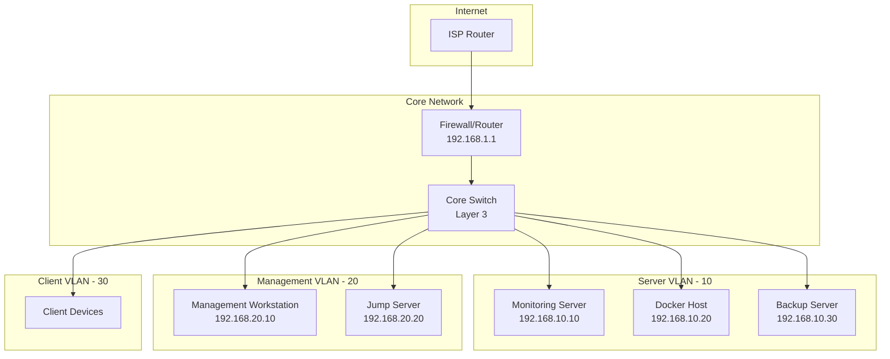

# Network Architecture / Hálózati Architektúra

## Áttekintés / Overview

Ez a dokumentum a homelab hálózati architektúrát írja le.
This document describes the homelab network architecture.

## Hálózati Topológia / Network Topology



## IP Címtartományok / IP Address Ranges

| VLAN | Név / Name | Subnet | Gateway | Leírás / Description |
|------|------------|--------|---------|---------------------|
| 1 | Management | 192.168.1.0/24 | 192.168.1.1 | Alapértelmezett / Default |
| 10 | Servers | 192.168.10.0/24 | 192.168.10.1 | Szerverek / Servers |
| 20 | Management | 192.168.20.0/24 | 192.168.20.1 | Kezelési eszközök / Management tools |
| 30 | Clients | 192.168.30.0/24 | 192.168.30.1 | Kliens gépek / Client devices |
| 40 | IoT | 192.168.40.0/24 | 192.168.40.1 | IoT eszközök / IoT devices |
| 99 | Quarantine | 192.168.99.0/24 | 192.168.99.1 | Karantén / Quarantine |

## Tűzfal Szabályok / Firewall Rules

### Alapértelmezett Szabályok / Default Rules

| Forrás / Source | Cél / Destination | Port | Protokoll | Művelet / Action |
|----------------|------------------|------|-----------|-----------------|
| Any | Internet | 80, 443 | TCP | ALLOW |
| Servers | Internet | 80, 443, 53 | TCP/UDP | ALLOW |
| Management | Servers | 22, 3389, 9090, 3000 | TCP | ALLOW |
| Clients | Servers | 80, 443 | TCP | ALLOW |
| Internet | DMZ | 80, 443 | TCP | ALLOW (NAT) |
| IoT | Internet | 443 | TCP | ALLOW |
| IoT | Internal | * | * | DENY |

### Port Kiosztások / Port Assignments

| Szolgáltatás / Service | Port | Protokoll | Leírás / Description |
|------------------------|------|-----------|---------------------|
| SSH | 22 | TCP | Secure Shell |
| HTTP | 80 | TCP | Web traffic |
| HTTPS | 443 | TCP | Secure web traffic |
| Grafana | 3000 | TCP | Monitoring dashboard |
| Prometheus | 9090 | TCP | Metrics collection |
| Alertmanager | 9093 | TCP | Alert management |
| Node Exporter | 9100 | TCP | Host metrics |
| Blackbox Exporter | 9115 | TCP | Endpoint probes |

## DNS Konfiguráció / DNS Configuration

### DNS Szerverek / DNS Servers

| Típus / Type | IP Cím | Leírás / Description |
|--------------|--------|---------------------|
| Primary | 192.168.1.1 | Internal DNS |
| Secondary | 8.8.8.8 | Google DNS |
| Tertiary | 1.1.1.1 | Cloudflare DNS |

### DNS Zónák / DNS Zones

```
homelab.local (belső / internal)
├── monitoring.homelab.local → 192.168.10.10
├── docker.homelab.local → 192.168.10.20
├── backup.homelab.local → 192.168.10.30
└── jumpserver.homelab.local → 192.168.20.20
```

## Biztonság / Security

### Hálózati Szegmentálás / Network Segmentation
- VLAN izoláció különböző hálózati zónákhoz
- Firewall szabályok zónák között
- IoT hálózat izoláció

### Hozzáférés Szabályozás / Access Control
- Management VLAN csak autorizált eszközökről
- SSH kulcs alapú hitelesítés
- VPN hozzáférés távoli menedzsmenthez

### Monitorozás / Monitoring
- Prometheus + Grafana
- Blackbox Exporter endpoint ellenőrzéshez
- Alert szabályok kritikus eseményekhez

## Bővítési Lehetőségek / Expansion Options

- DMZ VLAN külső szolgáltatásokhoz
- Guest VLAN vendégeknek
- VPN VLAN távoli hozzáféréshez
- Backup VLAN dedikált mentési hálózat
